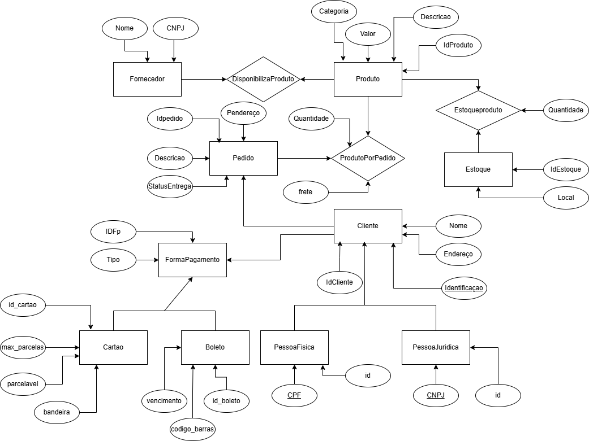

# modelagemBD

# 📦 Modelagem de Dados - Sistema de E-commerce  

Este repositório contém o **Diagrama Entidade-Relacionamento (DER)** de um sistema de e-commerce. O modelo foi projetado para gerenciar pedidos, clientes, produtos, fornecedores e formas de pagamento.

## 📌 Descrição do Modelo  
- **Cliente**: Representa os clientes do sistema, podendo ser **Pessoa Física** ou **Pessoa Jurídica**.  
- **Produto**: Contém informações sobre os produtos disponíveis, incluindo categoria, valor e estoque.  
- **Fornecedor**: Empresas que disponibilizam produtos para venda.  
- **Pedido**: Representa uma compra feita por um cliente, contendo a lista de produtos adquiridos.  
- **Forma de Pagamento**: Gerencia os métodos de pagamento disponíveis (**Cartão ou Boleto**), cada um com suas regras específicas.  
- **Estoque**: Controla a quantidade e localização dos produtos armazenados.  

## 📁 Arquivo do DER  
O diagrama foi criado no **draw.io** e pode ser visualizado abaixo: 

